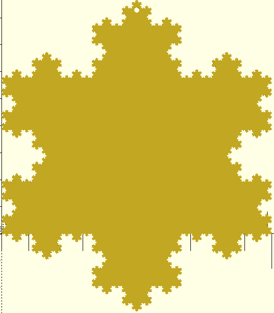

# Koch Snowflake OpenScad Generator



I wanted to create a 3D-printed Koch Snowflake for Christmas but couldn't
find a model that fit my needs. Therefore, I created this simple python
script to generate Koch Snowflakes for me. This tool can generate nice
Koch Snowflakes using Python and OpenScad. You can check out some
examples [here](examples/).

## How to Install

1. This project uses [poetry](https://python-poetry.org/docs/) install it first.
2. Clone this repository
3. `cd <cloned_repository>`
4. Run `poetry install`
5. Use the tool with `poetry run koch_snowflake`

## How to Use

```text
Usage: koch_snowflake [OPTIONS] OUT_FILE

Options:
  --size FLOAT                  Side length of the initial triangle in mm.
  --iterations INTEGER RANGE    Number of fractal iterations. More iterations
                                yield more complex snowflakes  [0<=x<=20]
  --thickness FLOAT             Thickness of the snowflake in mm.
  --with-hole / --without-hole  Whether you want a hole for hanging the
                                snowflake.
  --hole-radius FLOAT           The radius of the hole in mm.
  --hole-clearance FLOAT        The clearance of the hole to the outer
                                perimeter in mm.
  --help                        Show this message and exit.
```

## How it works

1. Python and numpy are used to calculate 3 Koch curves to form a triangle
2. The resulting points are then used to create OpenScad code using [openpyscad](https://pypi.org/project/openpyscad/)
3. You can render the resulting scad file using OpenScad and print as usual
